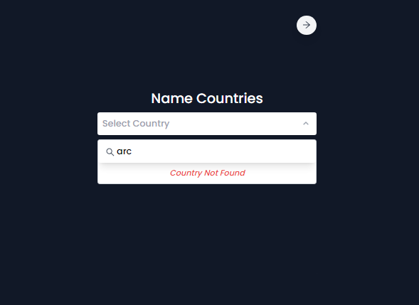

# SearchFilter and FormValidation

This repository contains two separate components: `SearchFilter` and `FormValidation`.

## Table of Contents

- [SearchFilter](#searchfilter)
  - [Overview](#overview)
  - [Files](#files)
  - [Installation](#installation)
  - [Usage](#usage)
- [FormValidation](#formvalidation)
  - [Overview](#overview)
  - [Files](#files)
  - [Installation](#installation)
  - [Usage](#usage)
- [Screenshots](#screenshots)

## SearchFilter

### Overview

The `SearchFilter` component allows users to select a country from a list. It provides an interactive dropdown selector with search functionality.

### Files

- **services/apiCountry.ts**: Fetches a list of countries from an external API.
- **interfaces/CountryRequest.ts**: Defines the country request object interface.
- **hooks/useFetchCountries.ts**: Custom hook for fetching countries.
- **utils/RegexUtils.ts**: Utility function to create regular expressions for search filtering.
- **components/Selector.tsx**: Main component providing the country selector functionality.
- **components/Path.tsx**: Navigation button to navigate to another component.
- **index.tsx**: Main entry point for the `SearchFilter` component.

### Installation

1. Clone this repository.
2. go to direcrory `cd search_filter`
3. Run `npm install` to install dependencies.
4. Run `npm start` to start the development server.
5. Open your browser and navigate to the specified URL to see the components in action.

### Usage

- **SearchFilter**: Allows users to select a country from a dropdown list and search for specific countries.

## FormValidation

### Overview

The `FormValidation` component provides a form for users to create an account with validation rules for fields like name, username, email, and password.

### Files

- **utils/handleRegex.ts**: Contains regular expressions for field validation.
- **components/FormValidation.tsx**: Main component providing form validation functionality.
- **components/Path.tsx**: Navigation button to navigate back to the `SearchFilter` component.
- **index.tsx**: Main entry point for the `FormValidation` component.
- **app.tsx**: Main entry point for rendering routes.

### Installation

1. Clone this repository.
2. go to direcrory `cd search_filter`
3. Run `npm install` to install dependencies.
4. Run `npm run dev` to start the development server.
5. Open your browser and navigate to the specified URL to see the components in action.

### Usage

- **FormValidation**: Provides a form for users to create an account with field validation rules.

## Screenshots

#### SearchFilter

#### FormValidation

